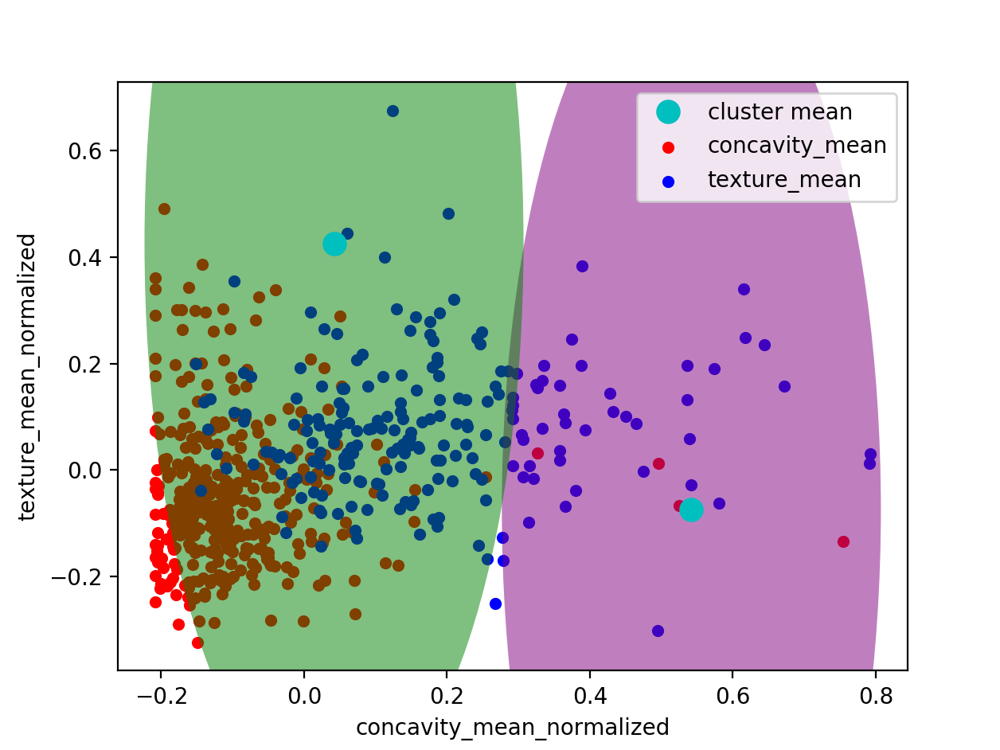
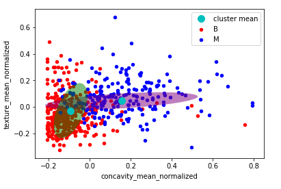
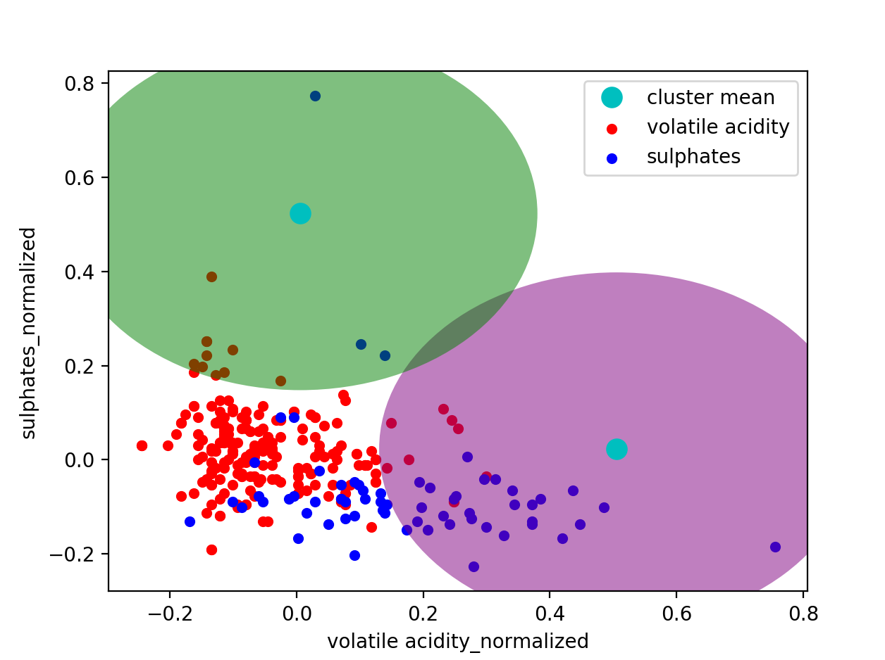

# EECS-738-Project-1
Machine Learning project. Build probability mixture models for Kaggle datasets.

Contributors: Ian Yake and Jules Garrett

# Expectation Maximization Algorithm:

Our algorithm consists of 4 steps: 
  1) Assign a random mean, standard deviation, weighting factor for each Gaussian. 
  2) Assign a responsibility for each point. 
  3) Find new means, standard deviation, and weighting factor taking into account each Gaussian's responsibility for each point.
  4) Check if the log likelihood is less than the tolerance level. If so, the algorithm stops; if not, the algorithm will return to step 2. 

# Data Set One:

Our first data set, breast cancer, we chose to use EM with two clusters since there is two different type of tumors being described in the data set: benign and malignant. We then chose two independent variables (radius mean and concavity mean) to analyze within the data set. 

# Data Set Two:

For our second data set we chose the Wine Quality Dataset. Since the quality of the wine was on a scale from 1-10, we catergorized the wine into good and bad categories. The bad wine category ranged from quality ratings of 1-4 and the good wine category ranged from 7-10. We decided to use EM with two clusters and two independent variables: pH level and volatile acidity of the wine. In our model we are only including values with a quality rating of 1-4 and 7-10. 

# How to Compile: 
Our project uses Python with Python libraries: matplotlib, numpy, pandas, math. To run this project: pip install matplotlib numpy pandas math. Then run python main.py for the first data set and python main2.py for the second dataset. To see the plots you'll need and IDE like jupyter or spyder. 

# References: 

https://www.ics.uci.edu/~smyth/courses/cs274/notes/EMnotes.pdf

https://scipython.com/blog/visualizing-the-bivariate-gaussian-distribution/

“Mixture Models and EM” Pattern Recognition and Machine Learning, by Christopher M. Bishop, Springer, 2007, pp. 437–439.

https://stackoverflow.com/questions/20126061/creating-a-confidence-ellipses-in-a-sccatterplot-using-matplotlib

https://stattrek.com/matrix-algebra/covariance-matrix.aspx

# Examples:

